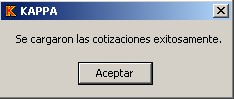
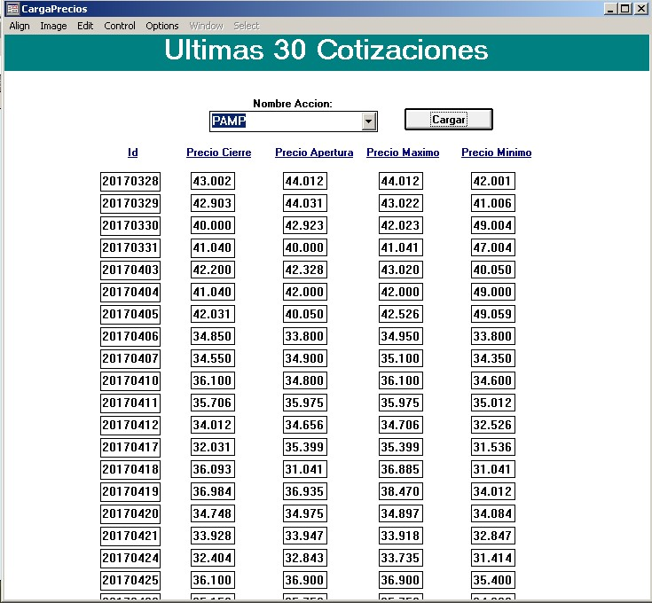
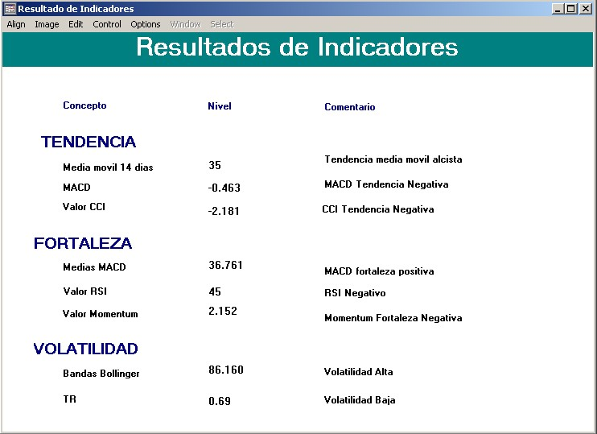
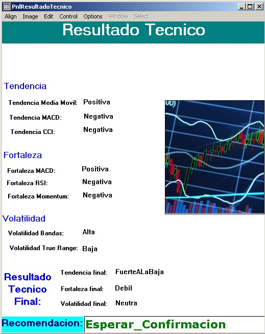
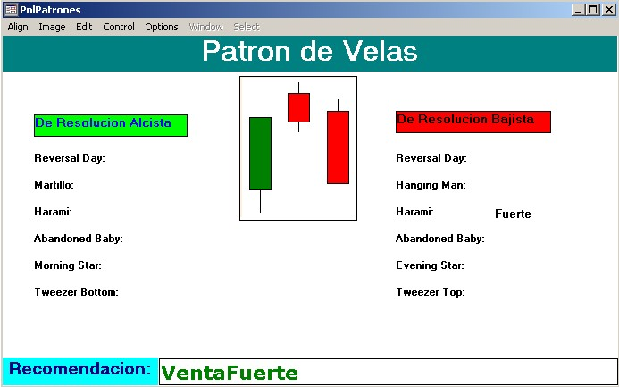

# stocks
Stocks analysis with Kappa PC

Expert System Developed in Kappa Pc to analyse the trend based on two experts.
The sistem analise the trend, the strong of it and volatility of the prices of stocks.
On the other hand its also analized some candle pattern.

An the end, the system will analise the patterns, the trend, 
the strong of the trend and volatility to make recomendations.

The expert system has 107 rules and 33 functions developed.

# Steps

1) Charge stocks prices from file (Cargar Cotizaciones)

2) Choose a Stock and charge last 30 stock prices to work only with that period (Últimas 30 cotizaciones)

3) Go to 'Resultado de Indicadores' where the system will throw the result of the indicators used.

4) Go to 'Resultado Tecnico'  where the system will determine the trend, the strong of it and volatility and throw a 
recomendation of what to do with the stock selected.

5) Click on 'Patron de Velas'  where the system will throw a 
recomendation of what to do with the stock selected based on Japanese candlestick pattern.

